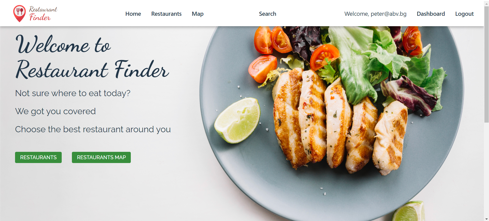
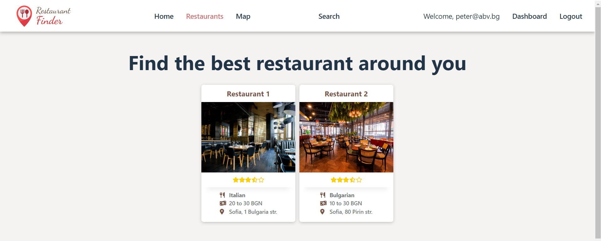
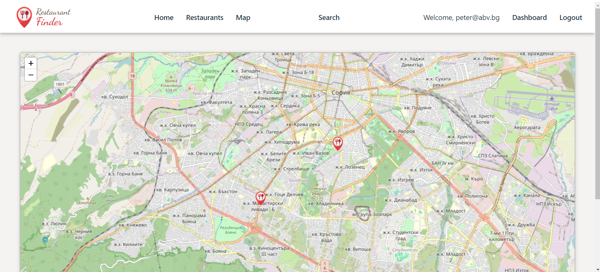
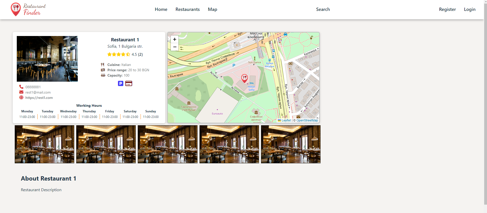
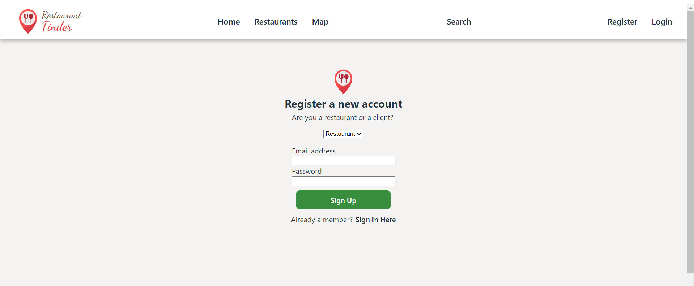
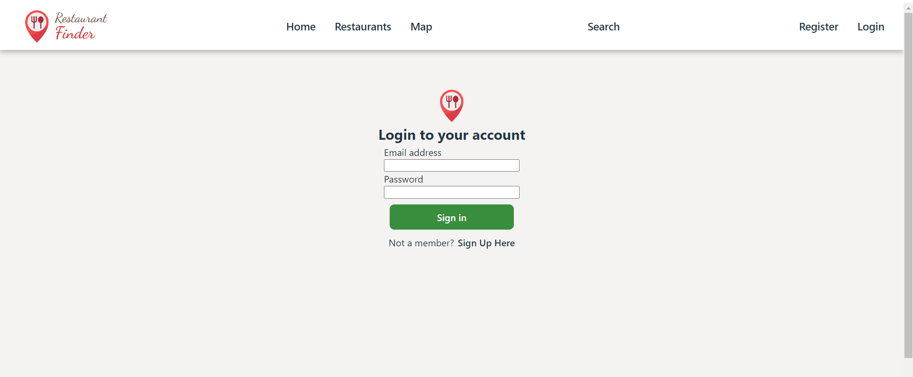
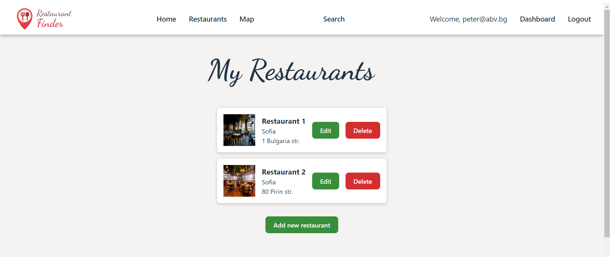
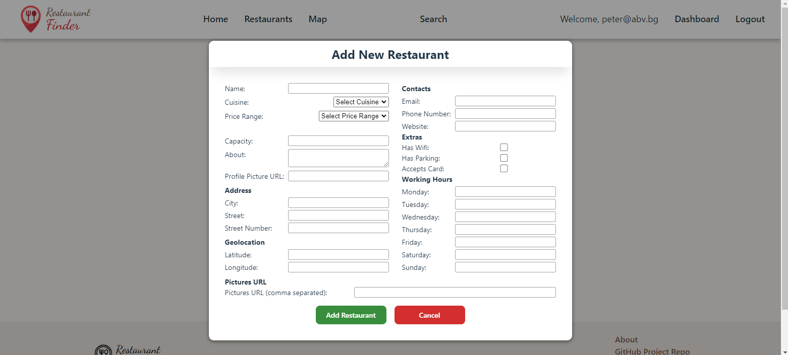
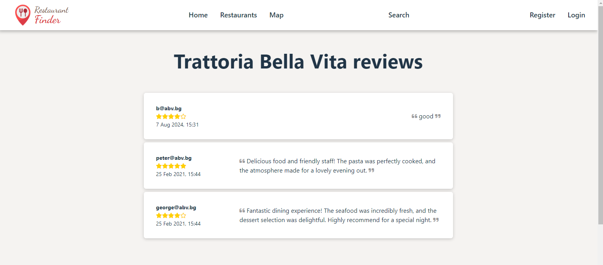

# RestaurantFinder App

# This is my defense project for SoftUni's React Course.

The project is deployed Render.com and you can access it from the following link:
https://restaurantfinder-fe.onrender.com/

**RestaurantFinder is a web application developed with React. The main purpose of the application is to show a catalog of restaurants in the area, so the client can choose a restaurant to visit.**

## Short Functionality Description:

The app has 2 types of users: **Restaurant** and **Client**
- **Restaurant** user can upload and manage his restaurants in the website
- **Client** user can leave reviews on the restaurants
- All users including guest users can browse restaurants

Visitors on the website can search for a restaurant based on different criteria.

## The project is developed using the following technologies:
- **For Back-end:** SoftUni Practice Server https://github.com/softuni-practice-server/softuni-practice-server
- **For Front-end:** React, LeafLet Maps Library, CSS

## Screenshots of the web application:

- Home page:

- Restaurants List page:

- Restaurants Map page:

- Restaurant Details page:

- Register Page

- Login Page

- Dashboard page:

- Add new restaurant page:

- Restaurant Reviews page:

